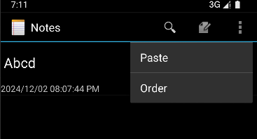

1）项目简介

本项目为一个基于Android开发的notepads项目，实现了时间戳,关键字查询以及排序功能

2）功能介绍

一.时间戳显示
1.首先在res/layout中的noteslist_item中加入一个名为text2的TextView组件，用于存放时间戳，并与存放标题的text1形成线性布局，代码如下
~~<LinearLayout
xmlns:android="http://schemas.android.com/apk/res/android"
android:layout_width="match_parent"
android:layout_height="match_parent"
android:orientation="vertical">

    <TextView
        android:id="@+id/text1"
        android:layout_width="match_parent"
        android:layout_height="?android:attr/listPreferredItemHeight"
        android:textAppearance="?android:attr/textAppearanceLarge"
        android:gravity="center_vertical"
        android:paddingLeft="5dip"
        android:singleLine="true"
        />

    <TextView
        android:id="@+id/text2"
        android:layout_width="wrap_content"
        android:layout_height="wrap_content"/>

</LinearLayout>~~

2.修改创建主界面的NoteList类的函数onCreate，使其投影出NotePad.Notes.COLUMN_NAME_MODIFICATION_DATE

修改这三处的代码

private static final String[] PROJECTION = new String[]{

NotePad.Notes._ID, // 0

NotePad.Notes.COLUMN_NAME_TITLE,// 1

NotePad.Notes.COLUMN_NAME_MODIFICATION_DATE

};

String[] dataColumns = {NotePad.Notes.COLUMN_NAME_TITLE, NotePad.Notes.COLUMN_NAME_MODIFICATION_DATE};

int[] viewIDs = {R.id.text1, R.id.text2};

3.修改完成后，会发现已经能够出现时间戳了，但并不是年月日形式，而是全部以秒数的形式呈现，所以我们可以利用修改adapter的setViewBinder来实现，代码如下

~~adapter.setViewBinder(new SimpleCursorAdapter.ViewBinder() {

public boolean setViewValue(View aView, Cursor aCursor, int aColumnIndex) {

if (aView.getId() == R.id.text2) {

String date = aCursor.getString(aColumnIndex);

String formattedDate = formatDate(Long.parseLong(date));

// 格式化日期

((TextView) aView).setText(formattedDate);

return true;

}

return false;

}

            private String formatDate(long seconds) {
                // 创建一个SimpleDateFormat对象，用于将Date对象格式化为"YYYY-MM-DD"格式的字符串
                SimpleDateFormat outputFormat = new SimpleDateFormat("yyyy/MM/dd hh:mm:ss aa", Locale.getDefault());

                // 将自系统初始时间以来的秒数转换为Date对象
                Date date = new Date(seconds * 1L); // 注意：Date构造函数需要毫秒值，所以乘以1

                // 使用SimpleDateFormat对象将Date对象格式化为字符串
                return outputFormat.format(date);
            }

        });~~
先利用setViewValue格式化日期，再利用formatDate修改为年/月/日形式，这部分为时间戳功能的核心代码

4.最后是完全实现时间戳功能的效果图

二.根据内容或标题查询功能

1.首先我在list_options_menu中加入如下代码以使我的界面上能出现一个放大镜，作为查询功能的入口

加入代码后有如下效果

2.然后我通过重写onCreateOptionsMenu方法来实现我的查询功能，使得点击放大镜后即可进行查询
这也是这一功能的核心代码：

~~@Override

public boolean onCreateOptionsMenu(Menu menu) {

// Inflate menu from XML resource

MenuInflater inflater = getMenuInflater();

inflater.inflate(R.menu.list_options_menu, menu);

        // Generate any additional actions that can be performed on the
        // overall list.  In a normal install, there are no additional
        // actions found here, but this allows other applications to extend
        // our menu with their own actions.
        Intent intent = new Intent(null, getIntent().getData());
        intent.addCategory(Intent.CATEGORY_ALTERNATIVE);
        menu.addIntentOptions(Menu.CATEGORY_ALTERNATIVE, 0, 0,
                new ComponentName(this, NotesList.class), null, intent, 0, null);

        //获取指定菜单项
        MenuItem menuItem = menu.findItem(R.id.search);  //根据菜单项ID获取
        //MenuItem menuItem1=menu.getItem(0);
        //获取搜索框
        final SearchView searchView = (SearchView) menuItem.getActionView();

        searchView.setIconifiedByDefault(true);
        //设置提示字符串
        searchView.setQueryHint("请输入你要查询的字符");
        //设置提交按钮有效
        searchView.setSubmitButtonEnabled(true);
        //设置键盘信息-回车键变搜索键
        searchView.setImeOptions(EditorInfo.IME_ACTION_SEARCH);

        //设置查询文本监听器-输入文本时出现建议
        searchView.setOnQueryTextListener(new SearchView.OnQueryTextListener() {
            @Override
            public boolean onQueryTextSubmit(String query) {
                searchNotes(query);
                searchView.clearFocus();
                return true;
            }

            @Override
            public boolean onQueryTextChange(String newText) {
                searchNotes(newText);
                return true;
            }

            private void searchNotes(String query) {
                // 使用ContentResolver查询笔记
                String selection = NotePad.Notes.COLUMN_NAME_TITLE + " LIKE ? OR " + NotePad.Notes.COLUMN_NAME_NOTE + " LIKE ?";
                String[] selectionArgs = new String[]{"%" + query + "%", "%" + query + "%"};

                // 执行查询
                Cursor cursor = getContentResolver().query(
                        NotePad.Notes.CONTENT_URI, // 内容URI
                        PROJECTION,
                        selection,
                        selectionArgs,
                        NotePad.Notes.DEFAULT_SORT_ORDER
                );

                // 更新ListView的适配器
                getListView().setAdapter(new SimpleCursorAdapter(
                        NotesList.this,
                        R.layout.noteslist_item,
                        cursor,
                        new String[]{NotePad.Notes.COLUMN_NAME_TITLE, NotePad.Notes.COLUMN_NAME_MODIFICATION_DATE}, // 数据列
                        new int[]{R.id.text1, R.id.text2},
                        0
                ));

                // 设置适配器的视图绑定器，用于格式化日期
                ((SimpleCursorAdapter) getListView().getAdapter()).setViewBinder(new SimpleCursorAdapter.ViewBinder() {
                    public boolean setViewValue(View aView, Cursor aCursor, int aColumnIndex) {
                        if (aView.getId() == R.id.text2) {
                            String date = aCursor.getString(aColumnIndex);
                            String formattedDate = formatDate(Long.parseLong(date));
                            ((TextView) aView).setText(formattedDate);
                            return true;
                        }
                        return false;
                    }

                    private String formatDate(long seconds) {
                        SimpleDateFormat outputFormat = new SimpleDateFormat("yyyy/MM/dd hh:mm:ss aa", Locale.getDefault());
                        Date date = new Date(seconds * 1L);
                        return outputFormat.format(date);
                    }
                });

            }
        });~~

在这段代码中我使用了监听器，使我的搜索框能够动态地根据使用者输入的字符来进行搜索
设置视图绑定器（ViewBinder）用于格式化日期显示避免直接使用findViewById来查找视图，这样可以减少代码中的样板代码，提高代码的可读性和可维护性

3.效果图

三.排序功能

1.首先添加一个Order的菜单项，是使搜索功能能有一个入口

效果

2.然后在NotesList里重写onOptionsItemSelected方法，补充一个Order事件，然后再Noteslist里写入排序方法，使得点击Order后可以选择按照时间或是首字母排序

代码如下

方法的代码如下

private void sortNotesByTitle() {

Cursor cursor = managedQuery(

getIntent().getData(),

PROJECTION,

null,

null,

NotePad.Notes.COLUMN_NAME_TITLE + " ASC"  // 按标题升序排序

);

updateListView(cursor);

}

    private void sortNotesByDate() {
        Cursor cursor = managedQuery(
                getIntent().getData(),
                PROJECTION,
                null,
                null,
                NotePad.Notes.COLUMN_NAME_MODIFICATION_DATE + " DESC"  // 按日期降序排序
        );
        updateListView(cursor);
    }

    private void updateListView(Cursor cursor) {
        SimpleCursorAdapter adapter = new SimpleCursorAdapter(
                this,
                R.layout.noteslist_item,
                cursor,
                new String[]{NotePad.Notes.COLUMN_NAME_TITLE, NotePad.Notes.COLUMN_NAME_MODIFICATION_DATE},
                new int[]{R.id.text1, R.id.text2},
                0
        );
        adapter.setViewBinder(new SimpleCursorAdapter.ViewBinder() {
            public boolean setViewValue(View aView, Cursor aCursor, int aColumnIndex) {
                if (aView.getId() == R.id.text2) {
                    String date = aCursor.getString(aColumnIndex);
                    String formattedDate = formatDate(Long.parseLong(date));
                    ((TextView) aView).setText(formattedDate);
                    return true;
                }
                return false;
            }

            private String formatDate(long seconds) {
                SimpleDateFormat outputFormat = new SimpleDateFormat("yyyy/MM/dd hh:mm:ss aa", Locale.getDefault());
                Date date = new Date(seconds * 1);
                return outputFormat.format(date);
            }
        });
        setListAdapter(adapter);
    }

实现效果

页面

按时间排序

首字母排序

3）项目总结以及展望

对于Android的开发能力有限，已经在能实现两项基本功能的基础上尽力实现突破，将两个基本功能与排序功能做的尽善尽美，希望接下来能攻克对笔记进行分类以及对UI的美化，优化项目的使用体验

